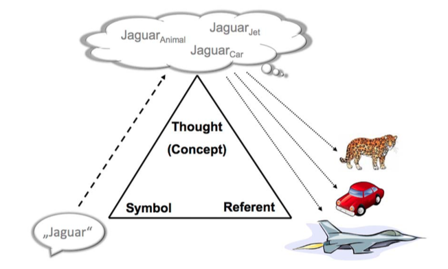

*本文的部分图片和内容来自中国科学院自动化研究所刘康老师的课件*

## Ontology（本体论）

Ontology 是（特定领域）信息组织的一种形式，是领域知识规范的抽象和描述，是表达、共享、重用知识的方法。

Ontology 是知识体系构建的关键技术，知识图谱是一种人工智能技术，它的关键在于让计算机能够处理人类的知识。然而，人类脑海中的知识通常是直觉性的，我们无法将这种直觉性的知识直接输入给计算机，Ontology 就是一种对知识建模，使计算机能够识别人类知识的方法。

本体（Ontology）通过对于概念（Concept）、术语（Terminology）及其相互关系（Relation, Property）的规范化（Conceptualization）描述，勾画出某一领域的基本知识体系和描述语言。

1. Explicit（准确性）：The concepts are explicitly defined
2. Formal（形式化）：Machine readable

3. Shared（共享的）：Accepted by a group and not private to some individual

### Ontology 的定义

Ontology 是一个由实体 < 类别、个体、关系、数据类型、数值> 以及它们的关系 <子类关系、正交关系、实例关系、等价关系> 组成的集合。具体的定义如下：

 

举一个具体的例子：

上图描述了一个实体《Bertand Russel: My life》这本书的一系列关系

+ 《Bertand Russel: My life》 是一本书，因此它和 Book（书） 有实例关系（instantiation）
+ 《Bertand Russel: My life》 的价格为 17，它和 17 这个数值有等价关系（assignment）
+ Book（书）是 Product（制品）的子类，因此它们是子类关系（specialisation）
+ Product（制品）和 Human（人类）没有直接关系，因此它们之间是正交关系（disjointness）

### Ontology 的特点

1. Explicit（明确的）：The concepts are explicitly defined
2. Formal（形式化）：Machine readable

3. Shared（共通的）：Accepted by a group and not private to some individual

### Ontology 的应用

#### 1. 知识推理

知识推理的主要目的就是由给定的知识获得隐含的知识。在本体中的推理从根本上说就是把隐含在显式定义和声明中的知识通过一种机制提取出来。

例如：

 Jaguar（美洲豹）是 Mammal（哺乳动物），Mammal 是 Animal（动物）可以推理出：Jaguar 是 Animal。

如果所有 Animal 都可以奔跑，那么 Jaguar 是 Animal，可以推理出 Jaguar 也可以奔跑。

#### 2. 歧义消解

在自然语言中，存在某些词汇具有不同的含义，Ontology 可以用来找到这些词的不同意义。例如，Jaguar 既是一种动物（美洲豹）也是一个汽车品牌（捷豹）。

